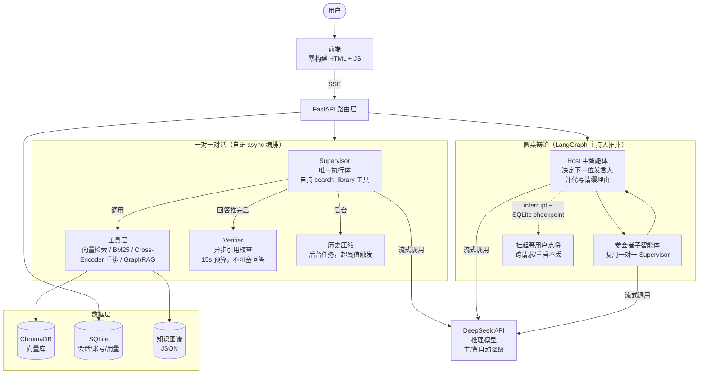

# 促膝（Multi-Agent RAG Persona Chat）

一个让你与历史名人、当代人气人物促膝而谈的 AI 应用：荣格、阿德勒、王阳明、峰哥、张雪峰，五位人物各有一套专属人设、知识库和界面主题。谈话分两种方式——「问道」（与先贤深谈，言必有据）与「会心」（与有趣的人闲谈，不设防）。

一对一对话是一条自研 async 编排——supervisor 直接持有检索工具，运行时决定查不查、查多深，没有状态图；圆桌（争鸣）在 LangGraph 上做主持人拓扑——那里控制流真有环，也需要跨请求挂起。前端零构建，手机优先。

---

## 截图

> 以下截图需自行准备并放入 `docs/images/`：
>
> - `home.png` — 首页人物轮播
> - `chat-rigorous.png` — 严谨区对话（荣格，带来源标注）
> - `chat-casual.png` — 轻松区对话（峰哥，沉浸模式）
> - `roundtable.png` — 圆桌辩论进行中


---

## 系统架构



### 控制流对比：一对一 vs 圆桌

| 维度 | 一对一 | 圆桌 |
|------|--------|------|
| 编排方式 | **无状态图**，自研 asyncio 编排 | **LangGraph**（图上有真环） |
| Agent 自由度 | 模型决定「查不查、查多深」（`strong` 参数分档） | Host 决定「下一位谁发言」 |
| 挂起 | 不需要（请求级无状态） | `interrupt()` + checkpoint，跨请求/重启不丢 |
| 收敛 | 单次回答即收敛 | 发言配额 + LLM 调用上限的数学保证 |
| 输出 | 带引用出处的回答 | 分歧地图（不评胜负） |

---

## 三个最值得讲的工程难题

### 1. 首字延迟：从 ~20s 到 ~2s

**问题**：用户问「你好」，系统也要走完整检索管线（改写 → 向量 + BM25 → RRF → 重排 → LLM），首字延迟 20 秒。

**解法**：
- 寒暄类消息由模型判定「不检索」，一次 LLM 直出（首字 ~2s）
- 检索端到端优化：查询改写默认关闭（实测 3.5s+ 超预算且不提升忠实度）、精排分数 LRU 缓存（2000 条含内容指纹，重复提问 0.05s）
- 检索管线 3.9s → 2.4s

**关键洞察**：不是「缓存一切」，而是「让模型自己决定什么值得检索」——工具描述里写清楚什么时候查、什么时候不查，比规则白名单更准。

### 2. 上游空响应容错：从 13s 卡死到 6s 重试

**问题**：模型网关偶发「HTTP 200 但 content 为空」，流式响应挂 13 秒后返回空壳，用户看到「正在思考」转圈后消失。

**解法**：
- 空响应检测 + 有限重试（最多 2 次）+ **首 token 超时**（默认 6s）
- 只在「未向用户推送任何 token」时重试，安全不重复输出
- 单次失败代价 13s → 6s，且失败时明确报错（SSE `type: 'error'`）而非静默回退

**代码**：`src/core/llm.py` 的 `ainvoke_nonempty` / `astream_nonempty`

### 3. 并发状态隔离：contextvars 消除配置串扰

**问题**：多用户并发时，如果 LLM 配置放在全局变量，A 用户的请求可能用到 B 用户的模型配置。

**解法**：用 `contextvars.ContextVar` 做请求级上下文隔离，每个异步任务独立持有自己的配置，互不污染。

---

## 性能指标（实测）

| 指标 | 数值 | 备注 |
|------|------|------|
| 首字延迟（寒暄） | **~2s** | 模型判定免检索，一次 LLM 直出 |
| 检索端到端 | **3.9s → 2.4s** | 关闭改写 + 精排缓存 |
| 重复提问精排 | **0.05s** | LRU 缓存命中 |
| 20 并发成功率 | **100%** | 16 核 CPU，全部成功无超时 |
| 20 并发延迟 | ~21-109s | CPU 精排是主要瓶颈 |
| 单请求基线 | ~20-30s | 含完整检索 + 生成 |
| 测试覆盖 | **350 个用例** | 编排、检索、状态隔离、异常处理 |

**并发优化**：`APP_WORKERS=2~4`（进程级并行，每 worker 独立加载模型约 2.5GB 内存）；限流/答案缓存是进程内的，多 worker 时各算各的。

---

## 评测结果

### 54 题 LLM-as-Judge 四维评估（主口径）

| 指标 | 得分（10 分制） |
|------|----------------|
| 忠实度 | **7.85** |
| 回答相关性 | **8.03** |
| 上下文精确度 | **7.50** |
| 要点覆盖率 | **7.50** |

**最有价值的不是分数，是归因**：分角色得分定位到王阳明的低分源于**传记类语料缺失**（检索精度 7.62 与其他两位持平，说明检索层没问题，是「库里根本没有」），由此得出「该修的是语料而不是检索」这一可执行结论。

### RAGAS 三维对照（53 题有效样本）

| 指标 | 得分（0–1） |
|------|------------|
| faithfulness | 0.5338 |
| answer_relevancy | 0.5628 |
| context_precision | 0.6331 |

**口径说明**：RAGAS 的 faithfulness 逐句核验回答是否落在上下文内，不给「人设化表达」留空间；而本产品是角色扮演，风格化措辞会被它判为不忠实，数值天然低于 10 分制。它的价值在**双轨交叉验证**与**检索层 / 生成层的分离诊断**。

评测集见 [`tests/eval_dataset_expanded.json`](tests/eval_dataset_expanded.json)，完整报告见 [`docs/eval-report.md`](docs/eval-report.md)。

---

## 快速开始

环境要求：Python 3.10+

```bash
# 1. 安装依赖
uv sync --extra dev          # 或 pip install -e ".[dev]"

# 2. 初始化语料（解析 md/pdf → 分块 → 向量化 → 写入 ChromaDB）
python init_persona_data.py  # 只重灌某个人物见「数据维护」

# 3. 启动服务
python main.py               # 默认 http://localhost:8000
```

### 配置自己的大模型 API

**本项目不内置任何 API Key，也不预置任何私有中转地址，需要你自己填。** 两种方式选一个即可：

**方式一：浏览器里填（推荐，无需改文件）**

启动后打开 http://localhost:8000 —— 首次访问会自动弹出配置页，填入自己的 API 地址 / API Key / 模型名即可。页面内置 DeepSeek 官方、阿里云百炼、智谱 GLM、月之暗面 Kimi 四家预设，点一下就能带出地址与模型名；填完可以先点「测试连接」验证，通过后再保存。

- 配置落盘在 `data/user_config.json`（已加入 `.gitignore`，不会随代码提交）
- 保存后**立即生效，无需重启服务**
- 之后想改模型名或换 Key：点对话页侧栏的「模型设置」即可
- 服务已配置完成后，再修改配置需要**本机操作**或携带管理员令牌（`MONITOR_TOKEN`），防止部署在公网时被人恶意替换 Key

**方式二：用 .env 配置（适合服务器无头部署 / 批量部署）**

```bash
cp .env.example .env         # 填 LLM_API_KEY / LLM_BASE_URL / LLM_MODEL
```

两者同时存在时**以浏览器里填的为准**；想改回只用 .env，删掉 `data/user_config.json` 即可。什么也没填也能正常启动，只是发起对话前会提示去配置。

启动后访问：

- 对话页面：http://localhost:8000
- API 文档：http://localhost:8000/docs
- 管理后台：http://localhost:8000/admin（用量监控 + 角色排行 + 自定义角色 + 知识图谱状态 + 意见反馈；上线前务必在 `.env` 设置 `MONITOR_TOKEN`）
- 成本统计（JSON）：http://localhost:8000/admin/stats（需令牌）

---

## 技术栈

| 层 | 技术 |
|----|------|
| 后端 | FastAPI + DeepSeek API（一对一：自研 async 编排 + LangChain 组件层；争鸣：LangGraph 主持人拓扑） |
| 向量检索 | ChromaDB + BAAI/bge-small-zh-v1.5（512 维，CPU 可跑） |
| 关键词检索 | rank-bm25（磁盘缓存，重启复用） |
| 重排序 | BAAI/bge-reranker-base（Cross-Encoder；可经 `RERANK_MODEL` 换成 v2-m3） |
| 前端 | 原生 HTML/CSS/JS 按功能分模块（零构建，静态文件直接服务） |
| 持久化 | SQLite（会话 / 账号 / 用量统计）+ ChromaDB（向量库） |
| 评估 | 自建 54 题 LLM-as-Judge 四维（主口径）+ RAGAS 三维全量对照 + pytest（350 个用例） |

---

## 功能亮点

- **账号系统（可选登录）**：邮箱/用户名 + 密码注册登录（pbkdf2 哈希 + HttpOnly Cookie 会话）；登录后对话额度按账号计算——共享出口 IP 不再互相误伤、换 IP 无法绕过；不登录也可直接使用
- **5 位可对话人物**：首页轮播选择 → 进入各自专属 UI；对话页只显示当前人物，可一键退回首页换人
- **对话可回溯可控**：任意回答一键**重新生成**（旧回答保留为多版本，可 ‹ › 随时切回）；任意提问可**编辑后重答**（之后的对话作废，后端历史同步截断）；每条回答支持浏览器**语音朗读**
- **角色卡导入/导出**：任意角色可一键导出原生 JSON 角色卡（人设/性格/场景/开场白/示例对话/世界书，自建角色含背景知识库），导入后立即可对话——角色设定可备份、可分享；**兼容社区通用 PNG 角色卡**（V2/V3 及旧版 V1，自研解析器实现格式互操作，仅处理用户主动导入的内容，不预装不分发任何第三方卡片）
- **每人一套视觉主题**：荣格=纸墨、阿德勒=印刷、王阳明=夜航、峰哥=街头、张雪峰=直播数据台；电脑端横排轮播，手机端堆叠卡片
- **沉浸模式**：峰哥/张雪峰关闭"要点/来源"展示，保持对话沉浸感；荣格/阿德勒/王阳明保留专业溯源
- **合规与信任**：首页与侧栏提供「使用须知 · AI 仿真声明」，明确角色为 AI 仿真、内容仅供参考、逝者语料仅收生前公开言论
- **法务三件套**：独立的「用户协议」（/terms）与「隐私政策」（/privacy）页面（含第三方 LLM 披露、账号注销、未成年人条款）；每条 AI 回答与圆桌发言带显著的「AI 生成」内容标识；支持一键注销账号（删除账号与全部登录会话）
- **一对一编排**：supervisor 是唯一执行体，自己持有检索工具——模型运行时决定「不查 / 轻量查（top-3 软背景）/ 强查（全管线 8 条完整段落带来源）」，教育区与娱乐区不再分两条路，差别落在工具的 `strong` 参数上；引用核查与历史压缩都在回答推完之后异步跑，不占首字
- **争鸣（圆桌会议）**：2-3 位人物同桌，就同一议题交锋——**主持人是一台 LangGraph 上的主智能体**（`framework/roundtable.py`），每轮由它决定「下一位谁发言」，并代写该角色的**请缨理由**（以自己的口吻概括），前端显示「某某主动请缨」而不是「主持人点名」；发言的子智能体复用的是一对一那套 supervisor 架构（自持检索工具、逐 token 流式），**子智能体之间没有边、只连主持人**；用户自任主持人时，会议在决策点挂起（`interrupt()` + SQLite checkpoint）等用户点将，**跨请求、跨进程、重启都不丢**；收敛靠发言配额的数学而非提示词调参，结尾只出**纪要（分歧地图）**、不评胜负，判断交回用户
- **混合检索 + 来源加权**：向量 + BM25 双通道，Cross-Encoder 重排；语料按 original/oral/anchor/secondary 分级加权，二手解读强降权，防止"第三者评价"冒充名人原话
- **防幻觉验证（异步旁路）**：专业型角色回答推流完成后，后台再对引用做核查与置信度标注，结果以引用出处事件补推——不阻塞回答、也不重答
- **工程化打磨**：限流、上传限制、会话 SQLite 持久化（重启不丢）、答案内存缓存、成本监控看板
- **并发可调**：BM25/向量/重排的 CPU 并发上限、torch 线程数、uvicorn worker 数全部走配置，低配机器和高并发场景各取所需

---

## 检索管线

1. **查询增强**：一次 LLM 调用同时生成查询变体（Multi-Query）与假设文档（HyDE）——**默认关闭**（`REWRITE_ENABLED=false`，原因见下节）
2. **双通道召回**：变体查询批量向量检索 + 原问 BM25 关键词检索（精确命中专有名词）
3. **RRF 融合 + 来源加权**：`source_profile.py` 按文件名把语料分为 original/oral/anchor/artificial/secondary，RRF 累加时乘以权重（secondary 0.25 强降权）
4. **Cross-Encoder 重排**：bge-reranker 对候选深度精排，取 top-K

### 检索提速 + 空库修复 + 主题重构（2026-08-29 晚）

**检索端到端 ~3.9s → 常态 ~2.4s，重复问题 0.05s**：
- **查询改写默认关闭**（`REWRITE_ENABLED=false`）：实测改写 LLM 延迟 3.5s+ 超过 2s 等待预算，每个新问题都白等 2s 后被放弃，且忠实度基线 8.8 恰是在改写无效状态下测得的——关闭零质量损失。召回不足时按 `.env.example` 说明打开。
- **精排分数 LRU 缓存**（2000 条，含文档内容指纹）：首页建议问题、高频问题重复提问时整批命中缓存，精排零推理（实测第二次相同请求 0.05s）。
- 澄清：预热后精排实际 ~1s/次（此前 4-6s 为未预热首测误导），不是主要瓶颈。

**娱乐区两角色向量库空壳修复**：persona_fengge（102 条）与 persona_zhangxuefeng（187 条）的 collection 文档全部为空字符串、metadata 为空——**这两个角色的"背景贴合检索"从上线起就没工作过**（静默返回空上下文）。已从源语料重灌并失效 BM25 缓存。

**图谱构建**：行式抽取 + 熔断 + 失败退避 + 备用模型逃生门全部就位；当天上游（sensenova 中转）对结构化抽取请求故障率极高（主/备模型均持续空响应），构建被熔断保护正确中止——待上游恢复后执行 `POST /persona/graph/build`（force=true）即可真实建图。

**前端视觉重构·第二版（深夜定稿）**：参照 Character.AI 式克制暗色 UI 重做——中性炭灰单色底（各角色仅底色微差），每角色一个低饱和强调色（荣格=哑铜金 / 阿德勒=哑陶土 / 峰哥=哑青绿 / 张雪峰=雾蓝），只允许出现在极小元素上；全面扁平化：去渐变、去光晕、去噪点纹理、发送按钮/用户气泡/输入框/徽章/弹层全部改中性面板+细边框；**移除全部 emoji 装饰图标**（选区卡、角色头像改名字首字徽章、徽章与提示语纯文字化）；修复选区页「返回」按钮未绑定事件的 bug；对话页细节打磨（思考指示器动画、时间戳对齐、头像圆形徽章）。纸墨（王阳明）保留未动。

### 上游空响应容错 + 图谱构建加固（2026-08-29 下午）

**根因诊断**（分阶段计时 + 语料扫描，脚本留存 `scripts/profile_rag.py`）：
- 语料质量：persona_jung 全库 2994 块扫描，**乱码块 0 个**（此前碎片重组已清理干净），块长中位 1158 字符——语料不是延迟原因；
- 知识图谱：3 个角色存在**空图谱文件**（0 实体）、荣格库有烂尾 tmp（66 chunk / 0 实体）——构建每次都空手而归；
- 上游 LLM：**中转存在随机性故障，HTTP 200 但 content 为空**（约 13s 超时后返回空壳，同一 prompt 时好时坏）。图谱抽取每批全空因此 0 实体；主链路分析拿到空响应靠重试救回——**这是教育区延迟波动（8s ↔ 21s+）的主因**；
- 精排实测：bge-reranker-v2-m3 在 CPU 上 5 对约 4-6s，是检索阶段 95% 的耗时；但实验证明它有价值（7/8 查询改变 top-1），跳过会明显伤质量。

**修复**：
1. **空响应检测 + 重试 + 首 token 超时**（`llm.ainvoke_nonempty` / `astream_nonempty`）：空壳响应视为失败立即重试（最多 2 次）。流式版另加**首 token 超时**（`llm_ttft_timeout`，默认 6s）——空壳要挂到上游自身超时才回（约 13s），等满纯属白等，卡住首 token 后单次尝试的代价从 13s 压到 6s。接入分析器（流式/直答）、角色直答、圆桌、图谱抽取——只在"未向用户推送任何 token"时重试，安全。分析节点重试耗尽仍无产出时**明确报错**（`LLMEmptyResponseError` → SSE `type:'error'`），不再回退"无资料直答"（那会丢掉本轮全部检索资料）。
2. **图谱抽取改行式格式**（`实体 | 关系 | 实体 | 证据`，一行一条）：绕开上游对结构化输出指令的故障模式，同时降低单批输出量。
3. **图谱构建熔断**：连续 5 批 0 三元组 → 判定上游不可用，中止并清理 tmp，不再白烧几百次调用。
4. **空图谱不算"已存在"**（`graph_exists` 要求 entities>0），空文件自动触发重建而不是永久装死；清理了 3 个空图谱文件与烂尾 tmp。
5. **自动构建失败退避**：构建失败后 1 小时内不自动重试（手动 force 不受限），防每次对话重复触发注定失败的构建。
6. **精排模型选择**：实测 base 比 v2-m3 快 3.4 倍，但 top-1 一致率仅 5/8 且不一致处质量更差。当时据此倾向"精度优先"；**仓库现默认值是 `BAAI/bge-reranker-base`**（`src/core/config.py` 的默认值与随附 `.env` 一致），要精度请自行换成 v2-m3。

### 检索延迟优化（2026-08-29）
- **改写与原始检索重叠**：查询改写（Multi-Query + HyDE，一次 LLM 调用，预算 2s）不再阻塞检索——原始查询的向量 + BM25 与改写 LLM 并行执行，原始路跑完后再收改写结果补跑变体路。改写等待从"串行白等"变为"被检索耗时吸收"，教育区首字延迟减少 0~2s（改写缓存命中时不变）。
- 改写自身已有三重兜底：语义缓存零等待复用 → 2s 等待预算 → 超时转后台补缓存；≤30 字符的短问题直接跳过改写（`SKIP_REWRITE_MAX_CHARS`）。

---

## 数据维护

```bash
# 只重灌某个人物（避免全量重建其他角色的大库）
python -c "import init_persona_data; init_persona_data.load_character_data('fengge')"

# 重灌后必须失效该角色的 BM25 磁盘缓存（磁盘缓存优先路径不校验数量）
python -c "from src.retrieval.advanced_search import invalidate_bm25_cache; invalidate_bm25_cache('persona_fengge')"
```

新增语料文件后，建议在 `src/retrieval/source_profile.py` 补文件名规则（如访谈→`oral`），否则新文件会落入 `unknown`（权重 1.0）。

---

## 人物与知识库

| 人物 | 定位 | ChromaDB collection | 语料构成 |
|------|------|---------------------|----------|
| 荣格 | 解梦大师 · 潜意识捕手 | `persona_jung` | 原著（心理类型/原型与集体无意识…）+ 演讲与回忆录（2,994 块） |
| 阿德勒 | 感情急救员 · 自卑超越教练 | `persona_adler` | 原著 + 演讲 + 《被讨厌的勇气》（后人虚构，降权）（1,193 块） |
| 王阳明 | 心学宗师 · 破心中贼专家 | `persona_wangyangming` | 传习录 + 传记精选（1,273 块，另有 65 份 epub/mobi 未入库） |
| 峰哥 | 下三路之神 · 街头社会学家 | `persona_fengge` | 2024 媒体专访实录 + 公开视频/直播语料（90 块） |
| 张雪峰 | 长跑之王 · 升学指路 | `persona_zhangxuefeng` | 5 本著作 + 深度采访 + 语录分类辑录（161 块） |

> 说明：张雪峰语料信息截止 **2026-03-24**（其离世日），仅收录生前公开言论，不掺悼念内容。
> 知识库已做碎片重组（2026-08-13）：扫描 PDF 的 OCR 逐行碎片（平均 40-60 字符）按原文顺序拼接去重后重新分块，块数从 188,661 降至 4,965（-97.4%），BM25 缓存与磁盘占用同步下降，检索质量反而提升（忠实度基线 8.8）。

---

## 项目结构

```
.
├── main.py                        # FastAPI 入口（启动预热 + 会话恢复）
├── init_persona_data.py           # 语料入库脚本（可指定单角色）
├── framework/                     # 编排与能力层
│   ├── supervisor_agent.py        #   一对一唯一执行体：supervisor 自持检索工具（含检索实现 retrieve_documents），运行时决定查不查/查多深
│   ├── runtime.py                 #   共享运行时设施：场景上下文 + 会话历史 + 消息装配 + 直接生成 + Chroma 单例
│   ├── analysis_agent.py          #   分析智能体（评测旁路与非人设场景）
│   ├── verification_agent.py      #   验证智能体（异步引用核查）
│   └── roundtable.py              #   争鸣：LangGraph 主持人拓扑（主智能体定人 + 子智能体发言 + 跨请求挂起）
├── scenes/persona_chat/           # 名人对话场景
│   ├── config.py                  #   场景与角色注册
│   ├── prompt_builder.py          #   酒馆式提示词装配（角色卡 + 世界书 + 后历史指令）
│   ├── card_io.py                 #   角色卡导出/导入（原生 JSON 格式）
│   ├── custom_store.py            #   自建角色持久化
│   └── characters/                #   每位人物的角色定义（人设/主题/开关）
├── src/
│   ├── api/routes.py              # REST + SSE 接口
│   ├── core/                      # 配置 / 会话存储 / 成本监控
│   ├── document_processing/       # 文档解析
│   └── retrieval/                 # 嵌入 / 分块 / 混合检索 / 重排 / 来源加权
├── data/persona_chat/             # 各人物语料（md/pdf/txt）
├── frontend/                      # 零构建前端（静态文件直接服务，无打包工具）
│   ├── index.html                 # 页面骨架（head + markup + 模块脚本引用）
│   ├── admin.html                 # 管理后台（独立单文件）
│   └── assets/
│       ├── css/main.css           # 主样式（五套主题）
│       ├── css/premium.css        # 补充样式（首页/对话页细节）
│       ├── js/core.js             # 全局状态 / DOM 引用 / 主题 / 工具函数（最先加载）
│       ├── js/storage.js          # localStorage + sessionStorage 双写持久化
│       ├── js/home.js             # 首页三段式流程（介绍→分区→选人→详情）
│       ├── js/conversations.js    # 会话列表 / 角色侧栏 / 对话管理
│       ├── js/chat.js             # 消息渲染 / SSE 查询 / 重新生成·编辑·朗读
│       ├── js/create.js           # 自建角色 / 角色卡导入
│       ├── js/roundtable.js       # 圆桌会议交互
│       ├── js/feedback.js         # 意见反馈
│       ├── js/auth.js             # 登录 / 注册 / 会话态
│       ├── js/setup.js            # 首次访问的模型配置页
│       ├── js/mobile.js           # 移动端适配（视口 / iOS 软键盘 / 布局）
│       ├── js/main.js             # 启动初始化（最后加载）
│       └── bg/                    # 首页人物背景图
├── scripts/
│   ├── cost_report.py             # 成本日报
│   ├── evaluate_ragas.py          # RAGAS 评估脚手架（需自行安装 ragas，见「测试与评估」）
│   └── profile_rag.py 等          # 检索剖析 / 重排质量对照 / 图谱质量审计等辅助脚本
└── tests/                         # 智能体 + API 集成测试
```

---

## 自建角色（用户创建人物）

除了内置的 5 位名人，任何人都能在前端「对话对象」侧栏点 **＋ 创建人物**，提交人物设定与背景，亲手造一个可对话角色。

### 两种创建方式

1. **完整手写**：填名字 + 背景知识（谁、生平、代表观点、名言、说话风格）+ 可选角色人设 prompt + 主题，直接创建。
2. **热门人物智能生成**：填名字（背景可空）→ 点 **智能收集资料**：后端联网搜索该人物的公开资料（Bing/百度/DuckDuckGo 多引擎兜底），交给 DeepSeek 合成一段人设提示词与结构化背景知识库草稿；你微调后点 **创建并开始对话**。

### 后端发生了什么

```
用户提交（名字 + 背景 + 可选 role_prompt + 是否联网）
   │
   ├─ 开启网络搜索 → web_research() 多引擎抓取片段（失败则静默降级为仅用用户背景）
   ├─ build_persona() 调 DeepSeek 合成 role_prompt / background（用户提供 role_prompt 则保留之，只合并背景）
   ├─ ingest_texts() 把 background 切块 → bge-small 向量化 → 写入独立 ChromaDB collection（custom_<id>）
   ├─ 落盘 data/persona_chat/custom/<id>.json（持久化，重启不丢）
   └─ 注册进场景配置 → 立即可在首页/侧栏选择对话
```

- 自建角色与内置角色走**完全相同的**检索 / 多智能体 / 引用核查链路，`enable_verification` 可单独关（沉浸型人设参考峰哥/张雪峰）。
- 背景被标记为 `anchor`（检索权重 2.0），即"用户提交的事实锚点"，高召回、高可信。
- 自建角色可随时删除（侧栏卡片 × / 详情页「删除角色」）：注销内存 + 删落盘 + 清向量库。

### 主要文件

| 文件 | 职责 |
|------|------|
| `scenes/persona_chat/custom_store.py` | 自建角色 JSON 持久化、id 校验/生成 |
| `src/web_search.py` | 零依赖（`urllib`）多引擎网络搜索，全程容错 |
| `scenes/persona_chat/persona_builder.py` | 把名字+背景+网络素材合成为 role_prompt 与 background |
| `src/retrieval/ingest.py` | 背景文本 → 切块 → 向量化 → 独立 collection |
| `src/api/routes.py` | `research` / `create` / `DELETE` 三个端点 |

> 网络搜索默认开启（`WEB_SEARCH_ENABLED`）。若部署环境无外网或希望纯手工录入，设为 `false` 即可；此时"智能收集资料"仅基于你填的背景生成。

## 知识图谱 RAG（GraphRAG 增强层）

在原有的「向量 + BM25 + Cross-Encoder 重排」混合检索之外，叠加一层**实体-关系知识图谱**检索，专治纯 chunk 检索的软肋：跨段落的概念网络、因果/从属/对立关系，向量检索很难一次性召回，而图谱能沿着关系链把相关实体和它的原始证据「连」出来再喂给 LLM。

### 两条链路

**1) 构建期（常驻可用，自动构建）**
- **无需用户手动点按钮**：角色首次被对话且图谱缺失时，聊天端点自动后台构建（`GRAPH_AUTO_BUILD`，默认开），构建完成后图谱即常驻可用；
- 也可在**管理后台 `/admin`** 手动触发，或调 `POST /persona/graph/build`（`force=true` 强制重建）；
- 后端分批把该角色的 ChromaDB chunk 送进 DeepSeek，抽取三元组 `实体 —关系→ 实体 + 证据片段`；
- 实体名归一化去重合并，关系按 `(head,关系,tail)` 聚合去重并累计权重；
- 每条关系**反查真实来源/章节**（证据片段匹配回原文 chunk），落盘 `data/persona_chat/graphs/<collection>.json`。
- 构建可能对全库 chunk 做几百次 LLM 调用（耗时数分钟），因此用**后台任务**跑，前端轮询 `GET /persona/graph/status`。

**2) 查询期（AI 自主判断，默认纯文本检索）**
- 默认只用「向量 + BM25 + 重排」文本检索；由 AI 在 `retrieve_documents`（`framework/supervisor_agent.py`）中自主调用 `should_trigger_graph_retrieval` 判断文本质量（用户无感知、无按钮）：
  - 文本召回条数不足（`GRAPH_TRIGGER_MIN_DOCS`）或 top 相关性偏弱（`GRAPH_TRIGGER_SCORE`）→ 启动图谱；
  - 查询命中图谱实体但文本结果没覆盖该实体 → 也启动图谱（实体覆盖缺口）；
  - 文本质量达标 → **跳过图谱**，不浪费子图扩展与证据并集的开销。
- 触发后 `retrieve_graph_context`：
  - 查询实体用**词法匹配**对齐图谱节点（零 LLM 调用，省掉原来每轮一次 API 往返）；
  - 从对齐节点做 **k 跳 BFS 子图扩展**，收集关联三元组 + 原始证据；
  - 证据文档挂**真实出处**并标注 `kg_inferred`（知识图谱推断，非人物逐字原话），去重并入 `retrieved_docs`；
  - `verification` 的引用出处会显示「（知识图谱推断）」，不再把关系三元组渲染成假书名冒充原著。
- 图谱文件不存在 / 构建失败 / 关闭开关 / 文本已达标 → **静默降级**，原混合检索完全不受影响。

### 配置（`.env`）

| 配置项 | 默认 | 说明 |
|--------|------|------|
| `GRAPH_RAG_ENABLED` | `true` | 总开关；图谱缺失时自动降级 |
| `GRAPH_AUTO_BUILD` | `true` | 角色首次被对话且图谱缺失时自动后台构建（常驻可用，无需用户点按钮） |
| `GRAPH_BUILD_BATCH` | `6` | 构建时每批送入 LLM 的 chunk 数 |
| `GRAPH_BUILD_MAX_CHUNKS` | `4000` | 单 collection 最多抽取多少 chunk（防爆 token） |
| `GRAPH_HOPS` | `2` | 查询期子图扩展跳数 |
| `GRAPH_TOP_ENTITIES` | `6` | 匹配上的种子实体最多扩展多少个 |
| `GRAPH_MAX_EDGES` | `30` | 子图返回关系条数上限 |
| `GRAPH_EVIDENCE_CHARS` | `260` | 单条证据片段截断字符数 |
| `GRAPH_TRIGGER_MIN_DOCS` | `3` | 文本召回不足即触发图谱的条数阈值 |
| `GRAPH_TRIGGER_SCORE` | `0.03` | 文本 top rrf_score 低于该值即触发图谱 |

### 端点

| 方法 | 路径 | 说明 |
|------|------|------|
| POST | `/persona/graph/build` | 为某角色构建知识图谱（后台任务；用户无需手动触发，系统自动构建，管理后台可手动触发；`force=true` 强制重建） |
| GET | `/persona/graph/status` | 查询图谱状态（`exists` + 后台任务 `building/done/error` + 实体/关系数） |

### 主要文件

| 文件 | 职责 |
|------|------|
| `src/retrieval/knowledge_graph.py` | 图谱构建（三元组抽取+合并+落盘）与查询期检索（实体对齐 + BFS 子图 + 渲染） |
| `framework/supervisor_agent.py` | 检索实现（`retrieve_documents`）：在混合检索后并入图谱证据文档 |
| `src/api/routes.py` | `graph/build` / `graph/status` 端点 |

---

## 备注

- 前端已模块化：`index.html` 只留页面骨架，样式与交互逻辑拆分到 `assets/css/` 与 `assets/js/`（12 个按功能划分的文件，按依赖顺序加载，无打包工具）；五套主题通过 CSS 变量切换
- 账号数据：`data/accounts.db`（用户 + 登录会话，pbkdf2 哈希存储密码；Cookie 为 HttpOnly，前端 JS 不可读）
- 本项目的定位是**展示型个人项目**：演示多智能体协作、混合检索、来源可信度设计与工程化细节；LLM 与向量模型均可在 CPU 上低成本运行

---

## 许可与合规

| 文档 | 内容 |
|---|---|
| [LICENSE](LICENSE) | 代码采用 **Apache-2.0**，可自由使用、修改、商用，需保留版权声明 |

两点必须说明：

1. **原始语料不进仓库。** 荣格、阿德勒、王阳明语料为已出版著作的电子版，受著作权保护；本仓库不包含这三个目录下的原始文档，`data/persona_chat/{jung,adler,wangyangming}/` 需使用者**自行准备合法来源**。娱乐区两位角色的背景素材为公开言论与访谈整理（Markdown），随角色人设一并提供。
2. **娱乐区两位角色取材于当代真实人物**（峰哥为在世公众人物；张雪峰为已故，语料仅收录其**生前**公开言论），牵涉真人形象与名誉。任何商业化使用前必须先取得授权或移除该角色；所有角色回答均为 **AI 生成**，不代表本人观点。
